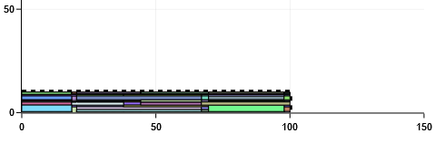
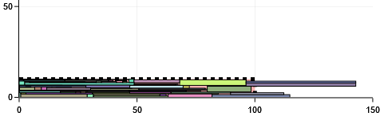

# Challenge ROADEF 2022

The 2022 ROADEF challenge presents an assignment problem for the logistic chain of Renault. As a young graduate of a computer science master degree with a specialization in Artificial Intelligence and Operational Research as of 2023, I present in this project my work to analyse, model, and solve the problem formulated by Renault. However, I am not a competing participant, I only work on this project for training as well as exploratory purposes.

$\rightarrow$ [Website of the challenge](https://www.roadef.org/challenge/2022/en/index.php).

## Brief summary of the subject

The objective is to pack a set of items from suppliers into stacks and to pack the stacks into trucks which deliver the plants, in order to minimize (a) the number of the trucks used and (b) the inventory in the plants due to early deliveries. Items have various properties (a time window of delivery, weight, dimensions...). 

Renault hired trucks from transporters to deliver the items from the suppliers to the plants. These hired trucks are defined in an annual planning and are called "planned" trucks. Trucks have properties which translate into constraints (maximum weight on axles, dimensions). All items must be delivered in time to their plants. If necessary, "extra" trucks can be called from the transporter to deliver items which could not fit into planned trucks, at an extra cost.

## Application

The ultimate goal of this project is to implement a julia application allowing to solve efficiently the truck loading optimization problem as described by Renault.

## Status of the project

The most up-to-date branch is [the feature branch adding weight constraints to the model for solving the single-truck placement problem](https://github.com/BrcRs/truck-stack-item-optimization/tree/wip-30-satisfying-weight), still in progress. The difficulty lies in adapting the placement algorithm to continue outputting interesting solutions while accomodating for weight constraints.

The most up-to-date working branch, the [develop branch](https://github.com/BrcRs/truck-stack-item-optimization/tree/develop), hosts a working algorithm (along with necessary framework) for solving the problem of packing efficiently items into stacks and stacks into a single truck as to satisfy most of stack constraints and supplier/plant order constraints.

_Optimal solution:_

_Solution returned by our algorithm:_

The truck is symbolized by a red zone with dotted border seen from above. Each rectangle represents a stack. Here we present an example of an instance of the single-truck packing problem and the result output by our algorithm. In this example we ignore weight constraints and plant/supplier orders.

## Content of this branch

The code is in `src/` directory. Tests are grouped by source file in the `tests/` directory.

Dependencies between source files are structured in a tree fashion.

**Core**

- `instance_loader.jl` defines functions to load data from a multi-truck instance.
- `placement.jl` defines `Dim`, `Pos`, `Stack`. Defines useful collision functions. Defines the collision checker for `Stack`.
- `mainplacement.jl` uses `placement.jl`. Mainly used to manually test `placement.jl`.
- `placement_visualizer.jl` uses `placement.jl`. Defines the function to visualize a solution to the single-truck packing problem.
- `ordered_stacks.jl` uses `placement.jl`. Defines `OrderedStack` (extends `Stack`). Extends constraint checker for plant/supplier orders. 
- `item.jl` uses `placement.jl`, `ordered_stacks.jl`. Defines the `Truck`, `Product`, `Item`, `ItemizedStack` (extends `OrderedStack`) data types. Defines item generator. Extends the constraint checker with weight constraints. Defines a valid stack checker. Defines a stack creator from items.
- `projected_pos.jl` uses `placement.jl`. Defines utility functions to deduce valid corners at which a stack can be placed. Defines `ProjectedPos`.
- `placement_algorithms.jl` uses `placement.jl`, `projected_pos.jl`, `item.jl`. Defines stack placing algorithm into partial solution. Defines the `BLtruck` algorithm which solves instances of single-truck item packing. Defines instance generator `cutandfuse_generator`.

**Miscellaneous**

- `coveragedata.jl`: sets-up code to document the coverage of the code by the tests.
- `matrix_ops.jl`
- `progress.jl`: custom progress bar.
- `start_local_server.jl`: debug the automatic doc generation.

**Outdated**

These files were written when the problem was modeled as a MILP.

- `column_generation.jl`: defines the column generator algorithm.
- `linear_infeasibilities.jl`: defines debug function to find infeasible constraints in a MILP.
- `model.jl` uses `instance_loader.jl`, `matrix_ops.jl`.
- `main.jl` uses `instance_loader.jl`, `model.jl`, `column_generation.jl`, `tsiproblem.jl`, `uzawa.jl`.
- `tsiproblem.jl` uses `instance_loader.jl`, `matrix_ops.jl`.
- `subproblem.jl` uses `matrix_ops.jl`, `tsiproblem.jl`.
- `uzawa.jl` uses `matrix_ops.jl`, `linear_infeasabilities.jl`, `progress.jl`, `subproblem.jl`, `tsiproblem.jl`. Defines the uzawa algorithm for the MILP placement problem.

## Contributors

I (@BrcRs) am the sole contributor of this project.
